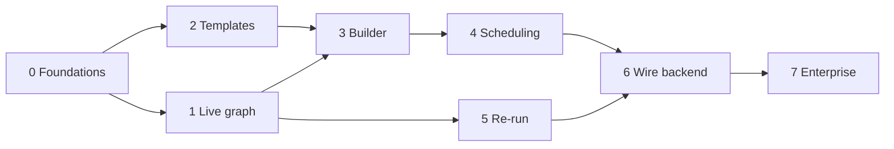

# AstroFlow — Roadmap (Console-First)

**Last updated:** 2026-06-21

This roadmap sequences the Console-first build. We prove the entire experience against mock
data, then wire each surface to the real backend. Each phase ends in something demoable.

---

## Phase 0 — Foundations
**Outcome:** the build/test loop works and the shell is on screen.

- Scaffold `console/` (Next.js App Router, TS, Tailwind, shadcn/ui, TanStack Query, Zod).
- Define the **data contract** (Zod schemas: `Workflow`, `TaskNode`, `TaskTemplate`,
  `Schedule`, `Run`, `TaskInstance`, `RerunRequest`).
- Implement `MockAdapter` with a seeded in-memory store and the **event simulator**.
- App shell: nav, top bar, theme toggle, command palette, routing.
- CI: lint, type-check, test, Lighthouse CI + bundle-size budgets.

## Phase 1 — Live workflow graph (read-only)
**Outcome:** "we can watch a pipeline run live."

- React Flow `LiveGraph` with custom status nodes and animated edges.
- Event-sourced run reducer; event coalescing per frame.
- Node drawer (logs, params, duration, attempts), status legend, minimap.
- Mock simulator replays realistic runs end to end.

## Phase 2 — Task-template catalog
**Outcome:** the governed building blocks exist and are browsable.

- Seed the starter template catalog (see [TASK_TEMPLATES.md](TASK_TEMPLATES.md)).
- Template catalog + detail, schema viewer, usage list.
- `SchemaForm` that renders + validates any template `param_schema` (drives the builder
  inspector too).

## Phase 3 — Dynamic workflow builder
**Outcome:** "business users build runnable workflows from the UI."

- React Flow builder canvas: palette, drag-to-add, connect, inspector, minimap, auto-layout.
- Continuous validation (DAG/acyclicity, required params, types, limits); problems panel.
- `WorkflowSpec` draft model with autosave, undo/redo, duplicate, task groups.
- Publish flow with versioning + diff (mock).

## Phase 4 — Self-service scheduling
**Outcome:** "users schedule workflows without code."

- Recurrence editor (presets + advanced cron with plain-English preview).
- Multiple schedules per workflow; parameter forms per schedule.
- Schedule list + enable/disable.

## Phase 5 — Run history & granular re-run
**Outcome:** "Step-Functions-style control."

- Run timeline + per-task drilldown; attempt diffs.
- Re-run scopes (whole run, from task, single task, failed only, branch) with
  affected-node preview and confirm.
- Attribution + audit trail (mock).

## Phase 6 — Wire to backend
**Outcome:** the Console runs on real data with no component rewrites.

- Implement `HttpAdapter` (REST + WebSocket/SSE) against the documented contract.
- Flip `NEXT_PUBLIC_API_MODE=live`; keep `MockAdapter` for tests/demos.
- Backend, per the deferred-execution model in [SYSTEM_ARCHITECTURE.md](SYSTEM_ARCHITECTURE.md):
  the **Controller** (spec compilation via the dynamic DAG factory, `execution.status`
  consumer, `task.result` emitter, WS fan-out, schedule materialization), the **Execution
  Engine** (does the compute), and the **deferrable-operator** package in Workflow Core
  (dispatch + defer; no compute in Airflow).

## Phase 7 — Enterprise hardening
**Outcome:** enterprise-ready.

- SSO (OIDC/SAML), RBAC (Viewer/Scheduler/Operator/Admin), multi-tenancy scoping.
- Audit everywhere, observability (Web Vitals + backend metrics), reconciliation,
  approval workflows for production tenants.

---

### Dependency view

Phases 1 and 2 can proceed in parallel after Phase 0. The builder (3) depends on both.
