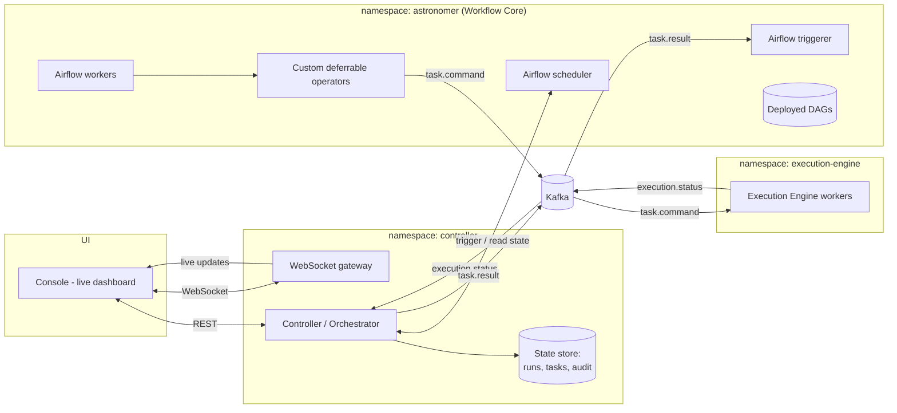

# AstroFlow — System Architecture (Deferred-Execution Model)

**Last updated:** 2026-06-21 · **Status:** Authoritative architecture for v1

> This document corrects and supersedes the architecture described in the earlier design
> notes. The key change: **Astronomer / Apache Airflow is used purely for workflow
> orchestration — it performs no compute.** All actual work happens in a separate
> **Execution Engine**. Airflow tasks **defer** while the Execution Engine runs, and a
> **Controller** resolves task state and keeps the UI dashboard live.

---

## 1. Core principle

**Airflow orchestrates; it does not execute.**

Custom operators contain **no business logic and do no compute**. When a task runs, its
operator does exactly two things:

1. Publishes a Kafka command telling the **Execution Engine** to do the work.
2. **Defers** — the task enters Airflow's `deferred` state, releasing the worker slot.

The heavy lifting happens in the Execution Engine, in its own namespace, completely
decoupled from Airflow. The **Controller** receives the execution result and resolves the
deferred task to `success` / `failed`, then pushes the change to the live UI dashboard.

**Two IDs drive correlation:**
- `execution_id`: minted by the Controller, travels across all components (UI, Kafka, Controller, Airflow). The business-level correlation key.
- `dag_execution_id`: Airflow's native run ID. The Controller maintains the mapping and uses it only for REST control (pause, kill, clear tasks, re-runs). Never exposed beyond the Controller.

This gives us: Airflow's mature scheduling, dependency, retry, and catchup semantics —
without coupling compute to Airflow workers, without leaking Airflow internals to the UI,
and with a real-time, business-friendly dashboard on top.

## 2. The three components (separate OpenShift namespaces)

| # | Component | OpenShift namespace | Responsibility |
|---|---|---|---|
| 1 | **Workflow Core** | `astronomer` | Astronomer/Airflow (scheduler, webserver, workers, **triggerer**), deployed DAGs, and the custom **deferrable operators** package. Orchestration only — no compute. |
| 2 | **Controller** | `controller` | The scheduler/astronomer-controller / workflow orchestrator. Consumes execution status, resolves Airflow task state, persists run/task state, and serves the **live UI dashboard** (REST + WebSocket gateway). |
| 3 | **Execution Engine** | `execution-engine` | Does the actual compute. Consumes task commands from Kafka, runs the work, and reports status back to the Controller. |

A shared **Kafka** event bus connects them (managed cluster or its own namespace). The
**UI / Console** is the dashboard the Controller keeps live; it talks only to the
Controller.



## 3. End-to-end flow

### 3.1 Startup handshake

1. **DAGs are deployed** into Astronomer (the `astronomer` namespace) by engineers. Each DAG is wrapped to register with the Controller on initialization.
2. From the **UI**, a user selects a DAG and either **runs it ad-hoc** or **schedules** it.
   The Controller mints a unique `execution_id` and triggers the DAG run in Airflow with this ID as a parameter.
3. The DAG initializes. Before any task runs, it calls the Controller to register:
   - **Input:** `execution_id` (from run parameters)
   - **Output:** Confirmation; the Controller stores the mapping `execution_id ↔ dag_execution_id` (Airflow's run_id)
   - This handshake ensures the Controller can track the run via REST (via `dag_execution_id`) and correlate events (via `execution_id`).

### 3.2 Task execution and deferral

4. Each task's **custom deferrable operator** executes:
   - Extracts `execution_id` from the run context.
   - Publishes a `task.command` Kafka event with `execution_id`, `dag_execution_id`, and task payload to the **Execution Engine**.
   - Calls `self.defer(...)` → the task enters **`deferred`** state (worker slot freed).

### 3.3 Compute and result reporting

5. The **Execution Engine** consumes `task.command`, performs the actual compute, and
   publishes its outcome as `execution.status` (including `execution_id`) to the **Controller**.

### 3.4 Resolution (two-lane pattern)

6. **Lane A — Per-task resume (trigger event):** The Controller consumes `execution.status`, applies orchestration logic, and:
   - Persists the new task state to its store (via `execution_id` + task ID).
   - Emits a `task.result` event (`success` / `failed`, keyed by `execution_id` + task ID).
   - Pushes the change to the **live dashboard** over WebSocket.

7. Airflow's **triggerer** receives the `task.result`, fires the trigger event, and the operator's `execute_complete` marks the task **success** or **failed** — so Airflow's
   own state stays authoritative and downstream tasks proceed normally.

8. **Lane B — Run-level control (REST API):** For pausing, killing, clearing tasks, or re-running:
   - The Controller uses `dag_execution_id` + Airflow REST API to execute run-level commands.
   - Run-level control and per-task deferral are decoupled: REST commands and trigger events don't interfere.

9. The **UI updates immediately** — any status change is reflected live without a refresh.

```mermaid
sequenceDiagram
    autonumber
    participant UI as Console (UI)
    participant CTRL as Controller
    participant AF as Airflow (scheduler)
    participant DAG as DAG / Operator
    participant TRIG as Airflow triggerer
    participant K as Kafka
    participant EE as Execution Engine

    UI->>CTRL: Run DAG (user action)
    CTRL->>CTRL: mint execution_id
    CTRL->>AF: Trigger DAG run (execution_id as param)
    AF->>DAG: Initialize DAG
    DAG->>CTRL: Register handshake (execution_id) → get dag_execution_id mapping stored
    AF->>DAG: Execute task
    DAG->>K: publish task.command (execution_id, dag_execution_id, payload)
    DAG->>AF: defer()  --> task state = DEFERRED
    Note over DAG,AF: No compute. Worker slot freed.
    K->>EE: deliver task.command
    EE->>EE: perform actual compute
    EE->>K: publish execution.status (execution_id, success/failed, result)
    K->>CTRL: deliver execution.status
    CTRL->>CTRL: resolve task; persist state (via execution_id)
    CTRL->>UI: live update over WebSocket (status changed)
    CTRL->>K: publish task.result (execution_id + task_id, success/failed)
    K->>TRIG: deliver task.result
    TRIG->>DAG: fire trigger -> execute_complete()
    DAG->>AF: mark task success / failed
    AF->>AF: schedule downstream tasks
```

## 4. The custom deferrable operators (no compute)

Built on Airflow's **deferrable operator + triggerer** mechanism. The operator is a thin
shim:

```python
# conceptual — astroflow_core/operators.py
class ExecuteOnEngineOperator(BaseOperator):
    """Pure-orchestration operator: dispatches work to the Execution Engine and defers.
    Performs NO compute itself."""

    def execute(self, context):
        execution_id = context["params"].get("execution_id")
        dag_execution_id = context["dag_run"].run_id  # Airflow run_id
        task_run_id = make_task_run_id(context)
        
        # Publish command with execution_id so all events can be correlated
        publish_kafka(
            topic="astroflow.task.command",
            key=execution_id,  # Partition by execution_id for ordering
            value={
                "execution_id": execution_id,
                "dag_execution_id": dag_execution_id,
                "task_run_id": task_run_id,
                "payload": build_command(context, self.params),
            },
        )
        # Release the worker; wait for the result event keyed by execution_id + task_id
        self.defer(
            trigger=TaskResultTrigger(execution_id=execution_id, task_id=context["task"].task_id),
            method_name="execute_complete",
        )

    def execute_complete(self, context, event):
        # Resumed by the triggerer when task.result arrives (keyed by execution_id + task_id)
        if event["status"] == "success":
            return event.get("result")          # task succeeds
        raise AirflowException(event.get("error"))  # task fails
```

Key properties:

- **No business logic / no compute** in Airflow — only dispatch + defer + resolve.
- **Worker efficiency:** deferred tasks hold no worker slot; thousands can wait
  concurrently on the triggerer.
- **Uniform:** every task type uses the same deferral pattern; the *command payload*
  differs, not the mechanism.

## 5. How tasks are resumed and controlled (two-lane pattern)

### Lane A: Per-task deferral resumption (trigger events)

The task is resumed by a **`task.result` event** that the Controller emits after it
receives `execution.status`. The Airflow **triggerer** runs a `TaskResultTrigger` that
listens (by `execution_id` + `task_id`) for that event and yields a `TriggerEvent`, which
causes `execute_complete` to set success/failed.

**Why this matters:** the Controller is the single place that owns task state, applies
orchestration policy, writes the audit record, and drives the live dashboard — so the same
event that updates the UI is the event that resolves the task. One source of truth. The
operator's `execute_complete` runs, so Airflow's state is always correct and downstream
tasks proceed naturally.

### Lane B: Run-level control (Airflow REST API)

For run-level operations (pause, kill, clear a task for re-run, backfill), the Controller uses
the `dag_execution_id` → Airflow REST API mapping. These operations are **decoupled** from
the per-task deferral mechanism: a REST-based kill does not interfere with pending trigger
events, and clearing a task for re-run doesn't touch the triggerer.

**Why two lanes:** Mixing them creates subtle state-divergence bugs. Deferral is about
individual task completion; run-level control is about DAG lifecycle. Keeping them separate
ensures each works reliably and consistently.

## 5.1 The DAG startup handshake

When a DAG run starts (either ad-hoc or cron-triggered), **before any task executes**, the
DAG must register with the Controller:

```
DAG initialization (Airflow)
  ├─ Extract execution_id from run params (ad-hoc: provided by Controller; scheduled: provided by DAG registration service or pre-allocated)
  ├─ Call Controller API: POST /runs/register { execution_id, dag_id, run_params }
  ├─ Controller stores: execution_id ↔ dag_execution_id (Airflow run_id) mapping
  ├─ Controller returns: acknowledgement
  └─ DAG proceeds to task execution (tasks can now emit task.command)
```

**Critical ordering:** Tasks must not emit `task.command` until the handshake completes.
If the handshake fails, the DAG should fail-fast rather than risk tasks whose events the
Controller cannot correlate.

**Scheduled DAGs:** For cron-triggered runs, the registration can happen either:
- **At parse time** (risky: if Controller is down, DAGs parse fails) — simpler but couples DAG parsing to Controller availability.
- **At run-trigger time** (safer: Airflow can defer registration if Controller is unreachable, retrying later) — requires a pre-hook in the Scheduler or Triggerer to run registration before the first task.

## 6. The Controller and the live dashboard

The Controller is the heart of real-time behavior:

- **Consumes** `execution.status` from the Execution Engine.
- **Resolves** each deferred task and **persists** run/task state to its store (so a user
  opening the dashboard later sees current state).
- **Emits** `task.result` to resume the Airflow task.
- **Fans out** every state change to subscribed UI clients over **WebSocket** (SSE
  fallback), scoped to the run / DAG the client is watching.
- **Reconciles** periodically against the Airflow REST API so persisted state stays correct
  even if an event is lost (events = fast & live; Airflow = authoritative).

The dashboard is therefore **live**: the moment a task changes state anywhere in the
pipeline, the Controller pushes it and the UI re-renders that node immediately — no polling,
no refresh. (UI performance budgets for this live behavior are in
[PERFORMANCE.md](PERFORMANCE.md).)

## 7. Kafka topics and correlation

| Topic | Producer | Consumer | Key | Payload includes | Purpose |
|---|---|---|---|---|---|
| `astroflow.task.command` | Deferrable operator (Workflow Core) | Execution Engine | `execution_id` | `execution_id`, `dag_execution_id`, `task_run_id`, task payload | "Do this unit of work." |
| `astroflow.execution.status` | Execution Engine | Controller | `execution_id` | `execution_id`, `task_run_id`, status, result | Report compute outcome. |
| `astroflow.task.result` | Controller | Airflow triggerer (Workflow Core) | `execution_id` | `execution_id`, `task_id`, status, error (if failed) | Resume the deferred task (success/failed). |
| `astroflow.run.events` *(optional)* | Controller | UI fan-out / analytics | `execution_id` | `execution_id`, dag info, run status | Run-level lifecycle for dashboards/audit. |

**Correlation by `execution_id`:** All events for a single run are keyed by `execution_id` so they land on the same partition, preserving order. The Controller maintains `execution_id ↔ dag_execution_id` mappings internally; Kafka topics never carry `dag_execution_id`.

**Delivery semantics:** At-least-once delivery + idempotent consumers (dedupe on event ID). The Execution Engine must safely handle replayed `task.command` events (idempotent by `task_run_id`).

## 8. OpenShift deployment notes

- **Namespace isolation:** Workflow Core (`astronomer`), Controller (`controller`), and
  Execution Engine (`execution-engine`) are deployed and scaled independently. Network
  policies allow only the required cross-namespace paths (each component ↔ Kafka;
  Controller ↔ Airflow REST; UI ↔ Controller).
- **Scaling:** the Execution Engine scales on `task.command` lag, independent of Airflow
  worker count; the triggerer scales to hold many deferred tasks; the Controller's
  WebSocket gateway scales behind a Redis/Kafka backplane.
- **Resilience:** because compute is decoupled, an Execution Engine restart doesn't lose
  Airflow work — deferred tasks simply wait for the result event. The Controller's
  reconciliation loop repairs any missed events.
- **Secrets:** connections/secrets used by the Execution Engine live in the platform
  secrets backend (e.g. Vault), never in Kafka payloads or DAG code.

## 9. Design decisions and remaining open questions

### Decided

- **Correlation model:** `execution_id` (Controller-minted, travels everywhere) vs `dag_execution_id` (Airflow's run_id, kept by Controller only). Ensures UI never sees Airflow internals.
- **Resume mechanism:** Two-lane pattern. Per-task resumption via `task.result` trigger events (preserves operator `execute_complete` and Airflow state consistency). Run-level control via Airflow REST API (pause, kill, clear, re-run). The lanes are decoupled.
- **Startup handshake:** DAG registers with Controller on initialization, providing `execution_id` and receiving confirmation that the `execution_id ↔ dag_execution_id` mapping is stored.
- **Execution Engine transport:** Kafka `execution.status` (for replayability, ordering, and decoupling). Events keyed by `execution_id` for correlation.

### Remaining open questions

- **Timeouts & failure of the Engine:** how long does a task stay deferred before the
  Controller times it out and fails the task? Define a per-DAG/-task SLA. Who emits the timeout failure — the Controller's watchdog, or a task-local SLA in the Engine?
- **Startup registration failure:** if the DAG fails to register with the Controller (network down, Controller unreachable), should the DAG abort immediately or retry? And how many times?
- **Execution Engine restart / mid-execution failure:** if the Engine dies while processing a task, the deferred task waits indefinitely. Does the Controller detect this via a heartbeat/watchdog, or rely on SLA timeout?
- **Ad-hoc vs scheduled DAG registration:** scheduled DAGs are parsed during scheduler scans. Do they register with the Controller at parse time (risky if Controller is down) or at run-trigger time (matches ad-hoc)?
- **Idempotency / retries:** if the Engine processes a `task.command` twice (network replay, Controller retry), the `task_run_id` must make re-delivery safe. Define the Engine's idempotency guarantee per task type.

## 10. Relationship to the other docs

- The **UI/Console** surfaces, the **live graph**, and the **dynamic workflow builder**
  remain as described in [CONSOLE_UI.md](CONSOLE_UI.md) and
  [WORKFLOW_BUILDER.md](WORKFLOW_BUILDER.md) — this document changes *what happens behind a
  running task* (defer → engine → controller → live update), not the UI experience.
- The earlier "wrapped operators emit start/end events and do the work" model is replaced by
  the **defer-and-dispatch** model above. Where other docs imply Airflow does compute, this
  document takes precedence.

## 11. Key refinements (v1.1)

This version clarifies:

- **Correlation IDs:** `execution_id` (business-level, travels in events and UI) vs
  `dag_execution_id` (internal, Airflow-specific, Controller-owned). Decouples UI from
  Airflow internals.
- **Startup handshake:** The DAG registers with the Controller before any task executes,
  establishing the `execution_id ↔ dag_execution_id` mapping so the Controller can both
  correlate events and drive REST control.
- **Two-lane resolution:** Per-task deferral resumes via trigger events (preserves Airflow
  state and operator completion logic). Run-level control uses Airflow REST API. Both coexist
  without interference.
- **Event keying:** Kafka events keyed by `execution_id` for ordering within a run and for
  UI subscription routing. Internal Airflow IDs never leak to Kafka.
