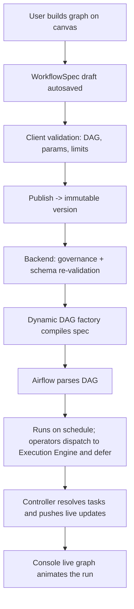

# AstroFlow — Dynamic Workflow Builder

**Last updated:** 2026-06-21 · **Status:** Spec for v1

The dynamic workflow builder is a drag-and-drop canvas where business users compose
runnable pipelines from reusable **task templates**, connect them into a directed acyclic
graph, configure each node's parameters, validate, and publish. It is the productized
answer to "create dynamic workflows from the UI."

> **Promoted from non-goal.** The original platform design listed a general low-code DAG
> builder as a v1 non-goal. This document supersedes that: the builder is now a v1 feature.
> The guardrails below are what keep it consistent with the platform principle of
> *self-service with guardrails* — users compose from **governed task templates**, not
> arbitrary code.

---

## 1. Mental model

A workflow is a graph:

- **Nodes** are *task-template instances* — a chosen [task template](TASK_TEMPLATES.md)
  plus the parameter values the user supplies.
- **Edges** are dependencies — "B runs after A succeeds" (with optional trigger rules:
  all-success, all-done, one-failed, etc.).
- The graph must be a **DAG** (no cycles). The builder enforces this continuously.

The builder never emits Airflow code. It emits a **WorkflowSpec** — a validated,
serializable description of the graph. The backend compiles that spec into an Airflow DAG.

## 2. WorkflowSpec (the artifact)

```jsonc
{
  "spec_version": "1.0",
  "id": "wf_3f9a",
  "name": "Daily Finance Close",
  "tenant_id": "finance",
  "owner": "user:rthangavelu",
  "status": "draft",                 // draft | published | archived
  "nodes": [
    {
      "node_id": "n1",
      "template_key": "snowflake_sql_load",
      "template_version": "2.3.0",
      "display_name": "Load dim_customer",
      "params": {
        "source_table": "raw.customers",
        "target_schema": "MART",
        "full_refresh": false
      },
      "retries": 2,
      "timeout_seconds": 1800,
      "position": { "x": 120, "y": 80 }   // canvas layout, ignored at runtime
    }
  ],
  "edges": [
    { "from": "n1", "to": "n2", "trigger_rule": "all_success" }
  ],
  "defaults": {                      // workflow-level defaults applied to nodes
    "retries": 1,
    "timeout_seconds": 3600,
    "pool": "default"
  }
}
```

Every `params` block is validated against the referenced template's `param_schema`
(JSON Schema / Zod). `template_version` is pinned at build time so a template change never
silently alters a published workflow.

## 3. Canvas UX

Built on **React Flow**.

### Surfaces
- **Node palette (left):** searchable, categorized list of task templates. Drag onto the
  canvas, or click to drop at center. Recently used and favorites pinned to top.
- **Canvas (center):** pan/zoom, snap-to-grid, marquee select, auto-layout (Dagre) button,
  minimap. Custom nodes show template icon, display name, a param-completeness indicator,
  and validation state.
- **Inspector (right):** context panel for the selected node — a form auto-generated from
  the template's `param_schema`, plus retries/timeout/pool overrides. For edges, the
  trigger-rule selector.
- **Top bar:** workflow name, validation status pill, **Validate**, **Save draft**,
  **Publish**, version selector, undo/redo.

### Interactions
- Drag a template → creates a node with default params.
- Drag from a node's output handle to another node's input handle → creates an edge.
- Edge creation that would form a cycle is rejected with an inline explanation.
- Multi-select + align/distribute; group into a **task group** (collapsible sub-graph).
- Keyboard: `⌘Z` / `⌘⇧Z` undo/redo, `Del` remove, `⌘D` duplicate, arrow-key nudge,
  full keyboard navigation of nodes (accessibility).
- Autosave drafts every few seconds; explicit version snapshots on publish.

## 4. Validation (client-side, continuous)

The builder validates live and blocks publish until clean:

| Check | Rule |
|---|---|
| **Acyclicity** | Graph must be a DAG. Cycle attempts blocked at edge creation. |
| **Connectivity** | No orphan nodes (warn); at least one start node. |
| **Required params** | Every node satisfies its template's required params. |
| **Type validity** | Param values type-check against the template schema (Zod). |
| **Reference integrity** | `template_key`/`version` exist and are approved for the tenant. |
| **Limits** | Node count, fan-out, and depth within tenant policy. |
| **Naming** | Unique, valid workflow + node display names. |

Errors surface in three places at once: the node badge, the inspector field, and a
problems panel. Publish is disabled with a summary of what's blocking it.

## 5. Versioning & lifecycle

- **Draft → Published → Archived.** Drafts are private to the editor + collaborators;
  publishing creates an immutable, numbered version.
- Each publish snapshots the full spec with pinned template versions.
- Editing a published workflow forks a new draft from the latest version; publishing it
  creates the next version. Running workflows are unaffected until the new version is
  activated.
- Diff view between any two versions (nodes added/removed, params changed).
- Full audit: who published what, when.

## 6. Compilation to Airflow (backend, later)

On publish, the backend compiles `WorkflowSpec` → an Airflow DAG via the **dynamic DAG
factory**:

```
WorkflowSpec  ──►  validate vs governance policy
              ──►  resolve each node to its task-template implementation
              ──►  instantiate deferrable operators (dispatch to Execution Engine + defer; no compute in Airflow)
              ──►  wire dependencies from edges + trigger rules
              ──►  attach schedule(s) (see scheduling subsystem)
              ──►  write/register DAG  ──►  Airflow parses it
```

At runtime, each operator publishes a `task.command` and defers; the Execution Engine does
the work and the Controller resolves the task and drives the live UI. See the
deferred-execution model in [SYSTEM_ARCHITECTURE.md](SYSTEM_ARCHITECTURE.md).

Guardrails enforced server-side at compile time: templates must be approved for the
tenant, params re-validated against the authoritative schema, resource limits applied,
secrets resolved from the secrets backend (never embedded in the spec).



## 7. Relationship to scheduling and re-run

- A published workflow can have **multiple schedules** (e.g. hourly for one config,
  nightly for another). The schedule builder attaches to a workflow version.
- The **same graph** the user built is the graph they watch run live and re-run against —
  one visual model across build, observe, and re-run. Node identity (`node_id`) is stable
  from spec → run → re-run, so "re-run from this node" maps cleanly.

## 8. Guardrails summary (why this is safe)

1. Users compose only from **approved, versioned task templates** — never free-form code.
2. Params are schema-validated client-side and re-validated server-side.
3. Tenant policy caps size, fan-out, depth, and which templates are usable.
4. Publishing is audited and immutable; running workflows are isolated from edits.
5. Secrets/connections resolve server-side from the secrets backend.

## 9. Open questions

- **Branching/conditionals:** expose conditional branch nodes (if/else, switch) in v1, or
  defer? *Recommend a simple branch template in v1, full expression editor later.*
- **Dynamic task mapping:** allow a node to fan out over a list param? *Recommend v1.1.*
- **Reusable sub-workflows:** publish a workflow as a callable template inside another?
  *Recommend v2.*
- **Collaboration:** real-time multi-user editing vs draft locking? *Recommend draft
  locking in v1.*
